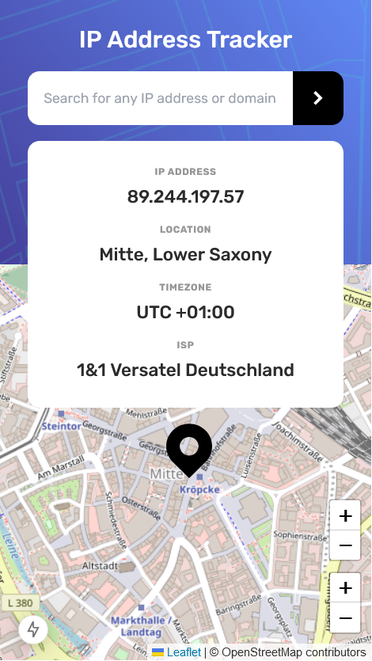
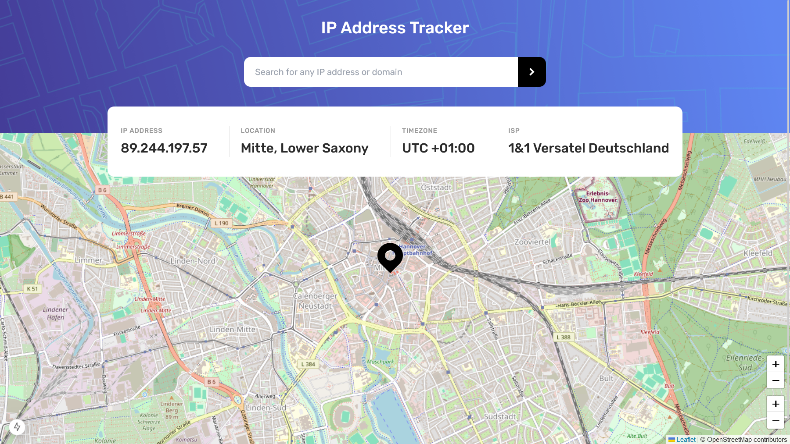

# Frontend Mentor - IP address tracker solution

This is a solution to the [IP address tracker challenge on Frontend Mentor](https://www.frontendmentor.io/challenges/ip-address-tracker-I8-0yYAH0). Frontend Mentor challenges help you improve your coding skills by building realistic projects.

## Table of contents

- [Overview](#overview)
  - [The challenge](#the-challenge)
  - [Screenshot](#screenshot)
  - [Links](#links)
- [My process](#my-process)
  - [Built with](#built-with)
  - [What I learned](#what-i-learned)
  - [Continued development](#continued-development)
  - [Useful resources](#useful-resources)
- [Author](#author)

## Overview

### The challenge

Users should be able to:

- View the optimal layout for each page depending on their device's screen size
- See hover states for all interactive elements on the page
- See their own IP address on the map on the initial page load
- Search for any IP addresses or domains and see the key information and location

### Screenshot

### Links

- Solution URL: [Github repository](https://github.com/Jenny-Eikens/ip-tracker)
- Live Site URL: [Add live site URL here](https://your-live-site-url.com)

## My process

### Built with

- Semantic HTML5 markup
- CSS custom properties
- Typescript
- Flexbox
- Mobile-first workflow
- [Next.js](https://nextjs.org/) - React framework
- [TailwindCSS](https://tailwindcss.com/) - CSS framework

### What I learned

This is the first project where I worked with APIs. I learned how to work with Next.js route handlers to make get requests. It took me some time to learn how to set up the function and understand how the Request object as a parameter, the URL API, and the Response API work in this context.

### Continued development

In the future, I would like to work on more projects that require the use of APIs to hone my skills in this area, as I am aware that a developer's job almost always includes working with APIs.

### Useful resources

- [YouTube video](https://www.youtube.com/watch?v=xirQ7AMyTM8)
- [YouTube video](https://www.youtube.com/watch?v=xThOII9T4i4)

These videos helped me understand route handlers in Next.js

## Author

- Website - [Jennifer Eikens](https://jenny-eikens.github.io/portfolio-page/#projects)
- Frontend Mentor - [@Jenny-Eikens](https://www.frontendmentor.io/profile/Jenny-Eikens)
- GitHub - [Jenny-Eikens](https://github.com/Jenny-Eikens)
